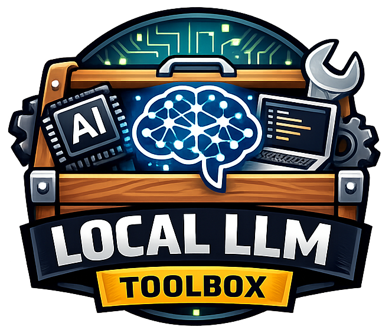

<div align="center">
  <picture align="center">
    <source srcset="./assets/logo.png">
    
  </picture>
    <div>
      <h1>Local LLM Toolbox</h1><br>
      <p>A tool for experimenting with local LLM hosting and management tools.</p>
    </div>
</div>

## Features

- **Multiple Backends**: Switch between llama.cpp and Microsoft Foundry
- **Web Dashboard**: Browser-based UI for managing backends and models
- **OpenAI-Compatible API**: Drop-in replacement for OpenAI API at `/v1`
- **RPC Clustering**: Distribute inference across multiple machines (llama.cpp)

## Supported Backends

| Backend | Platform | Model Format |
|---------|----------|--------------|
| **llama.cpp** | macOS, Linux | GGUF |
| **Foundry** | macOS, Windows | ONNX |

## Quick Start

### Prerequisites

- [Nix](https://nixos.org/download.html) package manager
- For llama.cpp: `llama-server` in PATH (installed via Nix flake)
- For Foundry: `foundry` CLI and `foundry-local-sdk` (macOS/Windows only)

### Installation

```bash
# Clone the repository
git clone https://github.com/your-org/local-llm-toolbox.git
cd local-llm-toolbox

# Enter the Nix development environment
nix develop

# Start the toolbox
./toolbox serve
```

The dashboard will be available at http://localhost:8090

### Adding Models

**For llama.cpp (GGUF models):**

Download GGUF files to `~/.local/share/models/`:

```bash
# Example: Download from HuggingFace
cd ~/.local/share/models
wget https://huggingface.co/bartowski/Qwen2.5-1.5B-Instruct-GGUF/resolve/main/Qwen2.5-1.5B-Instruct-Q4_K_M.gguf
```

**For Foundry (ONNX models):**

Use the download command or the web dashboard:

```bash
./toolbox download phi-4 foundry
```

## Usage

### Web Dashboard

Start the toolbox and open http://localhost:8090 in your browser:

```bash
./toolbox serve
```

From the dashboard you can:
- Start/stop backends
- Browse and load models
- Chat with loaded models
- Configure RPC clustering (llama.cpp)
- Monitor system resources

### CLI Commands

```bash
# Start the dashboard + API server
./toolbox serve
./toolbox serve --debug    # Enable verbose logging

# Backend management
./toolbox start llama      # Start llama.cpp backend
./toolbox start foundry    # Start Foundry backend
./toolbox stop             # Stop the active backend
./toolbox status           # Show current status

# Model management
./toolbox models           # List available models
./toolbox models llama     # List models for specific backend
./toolbox load <model>     # Load a model
./toolbox unload           # Unload current model
./toolbox download <model> # Download a model (Foundry only)
```

### OpenAI-Compatible API

The API is available at `http://localhost:8090/v1` and supports:

- `GET /v1/models` - List available models
- `POST /v1/chat/completions` - Chat completions (streaming supported)
- `POST /v1/completions` - Text completions
- `POST /v1/embeddings` - Embeddings (if supported by backend)

Example with curl:

```bash
curl http://localhost:8090/v1/chat/completions \
  -H "Content-Type: application/json" \
  -d '{
    "model": "qwen2.5-1.5b-instruct-q4_k_m",
    "messages": [{"role": "user", "content": "Hello!"}]
  }'
```

Example with OpenAI Python client:

```python
from openai import OpenAI

client = OpenAI(
    base_url="http://localhost:8090/v1",
    api_key="not-needed"  # No auth required
)

response = client.chat.completions.create(
    model="qwen2.5-1.5b-instruct-q4_k_m",
    messages=[{"role": "user", "content": "Hello!"}]
)
print(response.choices[0].message.content)
```

## Configuration

Copy `config.env.example` to `.env` and adjust as needed:

```bash
cp config.env.example .env
```

### Key Settings

| Variable | Default | Description |
|----------|---------|-------------|
| `DASHBOARD_PORT` | 8090 | Web dashboard and API port |
| `LLAMA_MODELS_DIR` | ~/.local/share/models | Where to look for GGUF models |
| `LLAMA_PORT` | 8080 | llama-server port |
| `LLAMA_CTX_SIZE` | 8192 | Context window size |
| `LLAMA_GPU_LAYERS` | 99 | Layers to offload to GPU |
| `FOUNDRY_PORT` | 5273 | Foundry service port |

See `config.env.example` for all available options.

## RPC Clustering (llama.cpp)

Distribute inference across multiple machines using llama.cpp's RPC feature.

### Requirements

- SSH access to the remote machine (key-based auth recommended)
- `rpc-server` from llama.cpp installed on the remote machine
- The remote `rpc-server` binary must be in PATH when SSH connects

### Setup via Dashboard

1. Start the llama.cpp backend
2. Click "Configure Cluster" in the dashboard
3. Enter the remote host details:
   - Hostname/IP
   - SSH username
   - SSH port (default: 22)
   - RPC port (default: 50052)
4. Save the configuration

The toolbox will SSH into the remote machine, start the RPC server, and configure llama-server to use it.

### Setup via Environment Variables

```bash
LLAMA_RPC_HOST=192.168.1.100
LLAMA_SSH_USER=llm
LLAMA_SSH_PORT=22
LLAMA_RPC_PORT=50052
LLAMA_SSH_TIMEOUT=30
```

### Limitations

- Currently supports only one remote node
- The remote machine must have `rpc-server` in PATH when SSH connects
- If you use a custom environment (conda, nix), ensure it's activated in your shell profile
